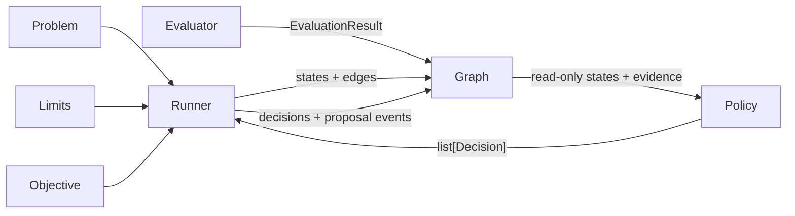
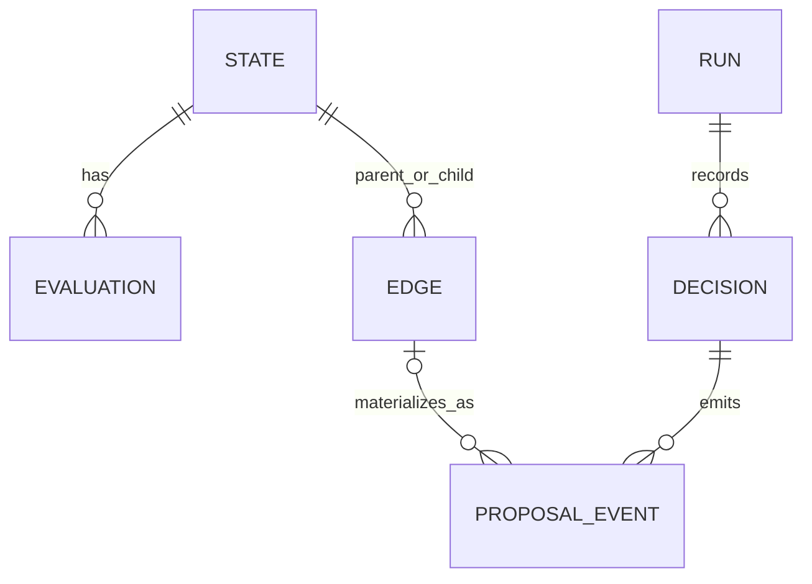

# Architecture

The core separates domain state, evaluator evidence, and policy provenance.
That distinction is the main invariant; the implementation is five small
record types over SQLite rather than a workflow engine.



## State and problem

A problem is duck-typed. The framework never interprets what a state means.

| Method | Role |
| --- | --- |
| `initial_state` | Root of the search |
| `state_key(state)` | Logical identity. Same key ⇒ same node |
| `apply(state, action)` | Deterministic transition |
| `validate_state` / `validate_action` | Optional hooks; raise to reject |

State contains only domain data needed to represent and expand the search
position. Agent prompts, transcripts, scalar objectives, and evaluation
evidence stay outside it. This makes `state_key` unsurprising and lets
convergent trajectories actually merge.

## Evaluation

An [`Evaluator`][yggdrisil.evaluation.Evaluator] maps a state to an
[`EvaluationResult`][yggdrisil.evaluation.EvaluationResult]: named scalar
metrics plus optional metadata. Stored
[`EvaluationRecord`][yggdrisil.types.EvaluationRecord]s are identified by:

```text
state_id + evaluator name + evaluator version + evaluator config
```

[`EvaluatorSuite`][yggdrisil.evaluation.EvaluatorSuite] is deliberately thin:
an ordered list evaluated sequentially. `evaluate_cached` avoids recomputing
the same evaluator identity for the same state. Scheduling, parallelism, and
aggregation remain application concerns until there is a concrete need for
more machinery.

## Policy and decision

A policy sees [`ReadOnlyStateGraph`][yggdrisil.graph.base.ReadOnlyStateGraph]
and [`RunStatus`][yggdrisil.limits.RunStatus]. It returns
[`Decision`][yggdrisil.policy.Decision] objects. A decision captures one policy
operation:

```python
Decision(
    role="explorer",
    selected_state_ids=[state_id],
    model="provider:model",
    input_context=prompt,
    tool_calls=tool_trace,
    output=model_output,
    proposals=[Proposal(parent_id=state_id, action=action)],
)
```

The in-memory decision becomes a durable
[`DecisionRecord`][yggdrisil.types.DecisionRecord]. This is where agent context,
model identity, tool calls, output, and notes live. A policy can return a
decision with no proposals—for example, a navigator call or a terminal
explorer result—and it is still recorded.

[`RandomPolicy`][yggdrisil.policies.random.RandomPolicy] samples from a callable
you provide. [`BestFirstPolicy`][yggdrisil.policies.best_first.BestFirstPolicy]
takes an explicit priority callable over a node and its evaluations.
[`NavigatorExplorerPolicy`][yggdrisil.agents.navigator_explorer.NavigatorExplorerPolicy]
records navigator and explorer calls separately, with no hidden chat history.

## Edges and proposal events

An [`Edge`][yggdrisil.types.Edge] is the canonical domain transition:

```text
(parent_id, child_id, action)
```

It is deduplicated. It does not own a `decision_id`, because several decisions
may independently propose the same transition.

Each proposal instead creates a
[`ProposalEvent`][yggdrisil.types.ProposalEvent]. After application, the event
links its decision to the canonical edge and records an outcome such as
`created`, `reused`, `failed`, or `skipped_*`. The event also keeps the proposal
metadata and its order within the saved batch so interrupted work can be
replayed without changing transition provenance or ordering.



This many-to-many join is the only extra graph bookkeeping needed for complete
provenance. The hot DAG remains states and edges.

## Runner

[`Runner.run`][yggdrisil.runner.Runner.run] loops until a limit, objective, or
empty proposal batch stops it:

1. Seed the initial state.
2. Ask the policy for decisions.
3. Persist each decision and its pending proposal events.
4. Validate and apply proposals.
5. Insert or reuse the canonical state and edge, then finalize each event.
6. Persist run status after every step.

Errors fail loudly. A rejected proposal is marked `failed`, later proposals in
that batch are marked `skipped_failure`, the run is persisted as failed, and
the original exception is raised.

SQLite is the source of truth for resume. Each graph/provenance write commits
independently, while `RunRecord.step` is the completed-batch checkpoint. On
reopen, the runner reconciles proposal events one step ahead of that checkpoint
before calling the policy: pending events are replayed against the idempotent
DAG, and already-finalized events advance the saved step. Failed attempts are
not mistaken for completed work and may be retried as new decisions.

The runner persists graph and run state, not arbitrary Python policy objects.
Policies should reconstruct context from the read-only graph and `RunStatus`.
The seeded built-in policies derive their random stream from the saved step for
exact continuation after reopening.

## Objective and limits

[`RunLimits`][yggdrisil.limits.RunLimits] stop on unique states, policy steps,
or wall time. [`Objective`][yggdrisil.objective.Objective] is optional scalar
run logic: it tracks the best state and can stop on a goal. It does not write
scores into node metadata and is not a substitute for evaluator evidence.

## Inspector and export

`yggdrisil inspect graph.sqlite` serves a local view that follows the DAG while
it grows. It reads tagged JSON without importing application classes and shows
states, actions, evaluations, decisions, tool calls, and proposal outcomes.

JSON, GraphML, and NetworkX exports include the same evidence and provenance:

```python
graph.export_json("graph.json")
graph.export_graphml("graph.graphml")
G = graph.to_networkx()
```

## What the core refuses to be

- A workflow engine
- A distributed task queue
- A domain or biology library
- A conversation store

Those can sit on Yggdrisil. They should not sit inside it.
