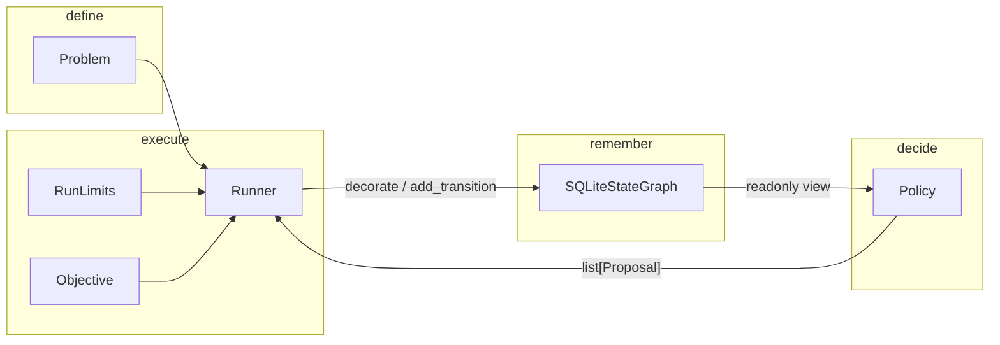

# Architecture

The runtime is intentionally small. Almost all intelligence lives in the
**policy**. Almost all durability lives in the **graph**.



## Problem

A problem is duck-typed. The framework never interprets what a state
*means*.

| Method | Role |
| --- | --- |
| `initial_state` | Root of the search |
| `state_key(state)` | Logical identity. Same key ⇒ same node |
| `apply(state, action)` | Deterministic transition |
| `validate_state` / `validate_action` | Optional; raise to reject |
| `decorate(state, metadata)` | Optional; fold proposal metadata into the child state (e.g. agent traces) |

`state_key` is the contract that makes the graph a DAG. If two
trajectories produce the same logical state, they must return the same
key. Agent transcripts belong on the state object via `decorate`, but
**must not** be part of the key, or merge breaks.

## Policy

A policy receives a query-only graph interface. The runner is the only runtime
component that writes. This is a design boundary for cooperating application
code, not a security sandbox. A policy receives a
[`ReadOnlyStateGraph`][yggdrisil.graph.base.ReadOnlyStateGraph] and
[`RunStatus`][yggdrisil.limits.RunStatus], and returns
[`Proposal`][yggdrisil.policy.Proposal]s: “apply this action to this
existing parent.”

```python
@dataclass(frozen=True)
class Proposal:
    parent_id: str
    action: Action
    metadata: dict = field(default_factory=dict)
```

[`RandomPolicy`][yggdrisil.policies.random.RandomPolicy] samples from a
callable you provide. [`BestFirstPolicy`][yggdrisil.policies.best_first.BestFirstPolicy]
expands the highest-scored frontier state.
[`NavigatorExplorerPolicy`][yggdrisil.agents.navigator_explorer.NavigatorExplorerPolicy]
asks a navigator *which* states to expand, then asks explorers *what* to
try — each call with a fresh context, no chat history. Explorers may
use tools. Put the transcript on `ExplorerResult.trace` →
`Proposal.metadata["trace"]`. Optional
An optional `Problem.decorate` method stamps that
metadata onto the child **state** before it is stored.

## Runner

[`Runner.run`][yggdrisil.runner.Runner.run] loops until a limit is hit or
the policy returns no proposals:

1. Seed the graph with `initial_state` if it is empty.
2. Ask the policy for a batch of proposals.
3. For each proposal: validate, `apply`, optional `decorate`, hash, then insert
   the state and edge in one transaction.
4. Persist run status after every step. Reopening the SQLite file
   resumes from the last step.

Each run stores a problem fingerprint derived from its type, initial-state id,
and public instance configuration. A `problem_fingerprint` attribute or method
can supply explicit identity data for more complex problems. A different
fingerprint is rejected before the graph is mutated.

Invalid parents raise
[`UnknownStateError`][yggdrisil.exceptions.UnknownStateError]
without writing edges. Invalid actions raise from the problem and leave
the graph as it was.

## Graph

[`SQLiteStateGraph`][yggdrisil.graph.sqlite.SQLiteStateGraph] is the
durable store. Nodes are unique `state_id`s. Edges are unique
`(parent, child, action)` triples. Inserting an edge that would create a
cycle raises [`CycleError`][yggdrisil.exceptions.CycleError].

Export is for inspection, not for the hot path:

```python
graph.export_json("graph.json")
graph.export_graphml("graph.graphml")
G = graph.to_networkx()
```

## Limits

[`RunLimits`][yggdrisil.limits.RunLimits] are hard resource stops:

- `max_states` — unique nodes, including the initial state
- `max_steps` — policy calls
- `max_wall_time_s` — wall clock

[`Objective`][yggdrisil.objective.Objective] is the optional improvement
signal. Its score is stored in node metadata, and `goal_reached` can stop the
run. The objective remains separate from limits because “best” and “too
expensive to continue” are different decisions.

## Inspector

`yggdrisil inspect graph.sqlite` serves a local web view that polls raw SQLite
rows. It shows the DAG as it grows and lets you inspect state/action payloads,
metadata, and traces. The viewer deliberately does not deserialize Python
objects, so inspecting an experiment does not require importing its code.

## What the core refuses to be

- A workflow engine
- A distributed task queue
- A biology library
- A conversation store

Those can sit *on* Yggdrisil. They should not sit *inside* it.
