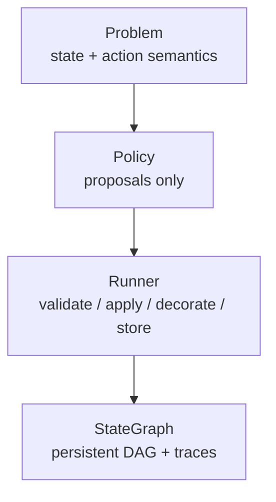

---
hide:
  - toc
---

# Yggdrisil

A small framework for agentic optimization through persistent tree/DAG
search. Policies propose transitions over user-defined states; the framework
applies, deduplicates, records, scores, and stops at hard limits.

Yggdrisil is a **search substrate**, not a general agent framework. You
write the problem, the tools, and the policy. Scientific ontologies,
simulators, and evaluators stay in that application code.

-   :fontawesome-solid-diagram-project: __Persistent DAG__

    ---

    The same logical state is stored once. Two trajectories that collide
    on [`state_key`][yggdrisil.problem.Problem] become one node with two
    parents.

-   :fontawesome-solid-shuffle: __Replaceable policies__

    ---

    Random search, a tool-using stand-in, or a language model. Same
    [`Runner`][yggdrisil.runner.Runner], same graph, same limits.

-   :fontawesome-solid-code-branch: __Runner-owned mutation__

    ---

    A policy sees a query-only
    [`ReadOnlyStateGraph`][yggdrisil.graph.base.ReadOnlyStateGraph] and
    returns [`Proposal`][yggdrisil.policy.Proposal]s. The runner applies
    them atomically. Agent traces belong on the **state**, not in chat
    history.

The worked example composes `1, 3, 4, 6` with arithmetic until the
value 24. Next steps are not a menu of legal moves: the policy calls
tools, and the transcript is stamped onto `node.state`. It is a small,
deterministic policy demonstrator rather than a competitive solver.

[Install](getting-started.md){ .md-button .md-button--primary }
[Build a search](tutorial.md){ .md-button }
[Architecture](architecture.md){ .md-button }
