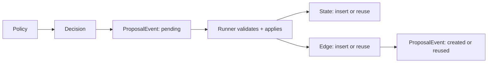
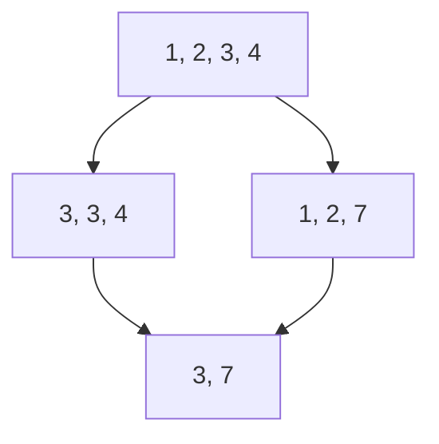

# Build a search

Yggdrisil does not ship a domain. A search combines a **problem**, optional
**evaluators**, and a **policy** that returns inspectable decisions. This page
builds Make-24: compose `1, 3, 4, 6` with `+ − × ÷` until the remaining value is
24.

The application layout is ordinary Python:

```text
problem.py    state, action, identity, transition
tools.py      add / subtract / multiply / divide
policy.py     navigator + explorer
run.py        Runner, graph, limits, objective
```

## 1. Keep state domain-only

A graph node stores a Python value. For Make-24, the whole state is the
remaining number pool:

```python
--8<-- "examples/make24/problem.py:pool"
```

Prompts, model outputs, evaluator metrics, and tool transcripts are not part of
the puzzle position. Keeping them out makes logical identity direct:

```python
--8<-- "examples/make24/problem.py:state_key"
```

If two paths reach `[3, 7]`, they return the same key and become one node with
multiple incoming edges.

## 2. Make actions reproducible

An action contains only the domain operation:

```python
--8<-- "examples/make24/problem.py:combine"
```

`Problem.apply(parent, action)` deterministically creates the child. Optional
`validate_action` and `validate_state` hooks raise when a proposal is invalid.
The runner, not the policy, calls these hooks and writes the graph.

```python
def apply(self, state: Pool, action: Combine) -> Pool:
    return apply_combine(state, action)
```

## 3. Give an explorer tools

When the next step is expensive or uncertain, the explorer need not receive a
precomputed move list. Here four arithmetic tools are bound to one pool. They
record both successful and failed probes:

```python
--8<-- "examples/make24/tools.py:kit"
```

A language model uses the same callables. Binding the toolkit per explorer call
keeps concurrent explorers independent.

## 4. Return an explorer result

The offline stand-in below calls those tools, ranks its probes, and returns
direct child actions:

```python
--8<-- "examples/make24/policy.py:explore"
```

[`ExplorerResult.trace`][yggdrisil.agents.navigator_explorer.ExplorerResult] is
adapter output. [`NavigatorExplorerPolicy`][yggdrisil.agents.navigator_explorer.NavigatorExplorerPolicy]
turns it into a durable explorer `Decision`:

- the current state id goes in `selected_state_ids`
- the formatted prompt goes in `input_context`
- tool calls go in `tool_calls`
- actions and the note go in `output`
- each direct child action becomes a `Proposal`

The navigator call is a separate decision, even though it proposes no edge.
There is no hidden conversation history.

```python
from yggdrisil.agents import NavigatorExplorerPolicy

lm = TinyMake24LM(problem, seed=0)
policy = NavigatorExplorerPolicy(lm, lm, goal="Make 24.", max_requests=2)
```

The PydanticAI adapter (`pip install "yggdrisil[agents]"`) produces the same
records with a real model.

## 5. Materialize proposals

For each policy step, the runner first stores decisions and pending proposal
events. It then applies proposals and links every attempt to the canonical
edge.



This matters when two agents propose the same transition. The graph keeps one
edge, while both decisions and both proposal events remain inspectable. Failed
and skipped attempts remain records too.

## 6. Run and inspect

```python
import asyncio

from yggdrisil import Runner, RunLimits, SQLiteStateGraph

from problem import Make24
from policy import tiny_policy


async def main() -> None:
    problem = Make24()
    graph = SQLiteStateGraph("run.sqlite")
    result = await Runner(
        problem,
        tiny_policy(seed=0, problem=problem),
        graph,
        RunLimits(max_states=40),
    ).run()

    hits = [node for node in graph.states() if problem.solved(node.state)]
    print(result.stop_reason, len(hits), "solutions")

    for decision in graph.decisions(result.run_id):
        if decision.tool_calls:
            print(decision.role, decision.tool_calls)

    graph.close()


asyncio.run(main())
```

While the runner is active, open another terminal:

```bash
yggdrisil inspect run.sqlite
```

The inspector follows the DAG as it grows. Select a state or edge to see linked
evaluations, decisions, prompts, tool calls, model output, and proposal
outcomes.

## 7. Add evaluation or another policy

Evaluation is independent of policy provenance. Run it explicitly for a single
state:

```python
from yggdrisil import EvaluationResult, EvaluatorSuite


class Distance:
    name = "distance"
    version = "1"
    config = {"target": 24}

    async def evaluate(self, state):
        return EvaluationResult(metrics={"distance": problem.distance(state)})


await EvaluatorSuite([Distance()]).evaluate_cached(graph, state_id)
```

Or pass the suite to `Runner` so the initial, restored, and newly materialized
states have cached evidence before the policy observes them:

```python
suite = EvaluatorSuite([Distance()])
result = await Runner(
    problem,
    policy,
    graph,
    RunLimits(max_states=40),
    evaluators=suite,
).run()
```

Independent evaluators can use `EvaluatorSuite([...], concurrent=True)`.

Best-first policy receives the stored evaluation records alongside each node.
It can use them or rank directly from state:

```python
from yggdrisil import BestFirstPolicy, RandomPolicy
from policy import llm_policy

RandomPolicy(problem.sample_actions, n_proposals=2, seed=0)

BestFirstPolicy(
    problem.sample_actions,
    lambda node, evaluations: -problem.distance(node.state),
    n_proposals=2,
    seed=0,
)

llm_policy("openai:gpt-4o-mini")
```

An optional `Objective` is separate: it tracks one scalar best value for the
run and may stop when a goal is reached. It does not mutate state or create an
evaluation record.

## Why this shape

| Application code | Runtime record |
| --- | --- |
| Domain position | `StateNode` |
| Deterministic transition | canonical `Edge` |
| Independent metrics | `EvaluationRecord` |
| Agent or policy operation | `DecisionRecord` |
| One attempted transition | `ProposalEvent` |

DAG merge for `[1, 2, 3, 4]`: `1+2` then `3+4` is the same final node as the
reverse order.



One solution of `1, 3, 4, 6`:

```text
3 / 4     →  [1, 6, 3/4]
1 - 3/4   →  [6, 1/4]
6 / (1/4) →  [24]
```

The last state is only `Pool(values=("24",))`. The explorer session that
proposed its incoming action lives in the linked decision.
