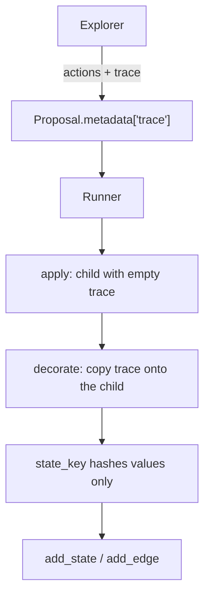
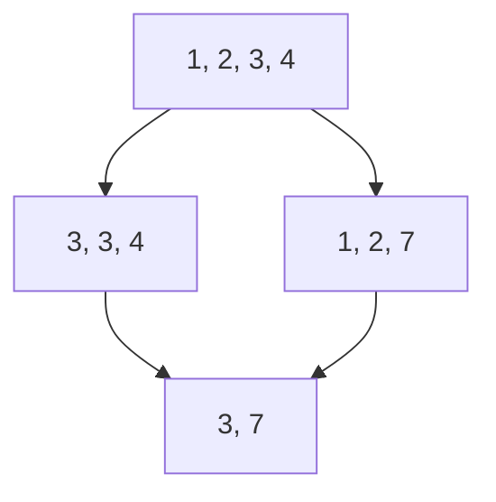

# Build a search

Yggdrisil does not ship a domain. A search is three pieces of
application code: a **problem**, **tools** that can fail, and a
**policy** that plays. This page builds a complete Make-24 search —
compose `1, 3, 4, 6` with `+ − × ÷` until the remaining value is 24.

The runner is the easy part. The work is:

1. Deciding what counts as the same logical state (`state_key`).
2. Giving the agent **tools** instead of a move list.
3. Storing the agent’s transcript **on the state** so the graph, not a
   chat log, is memory.

Layout in your project:

```text
problem.py    states, actions, identity, decorate
tools.py      add / subtract / multiply / divide
policy.py     navigator + explorer
run.py        Runner, graph, limits
```

## 1. State is identity plus memory

A graph node stores a Python object. Give it two jobs:

```python
--8<-- "examples/make24/problem.py:pool"
```

- `values` — remaining numbers. **Where** the search is.
- `trace` — tool calls the explorer made before this child was
  committed. **How** an agent thought.

If the trace is part of `state_key`, two explorers that reach `[3, 7]`
with the same arithmetic but different probes become two nodes. The DAG
does not merge. Hash only identity:

```python
--8<-- "examples/make24/problem.py:state_key"
```

The first writer’s object (including its trace) is what the node keeps.
Later edges into the same id still record that proposal’s metadata.

## 2. Actions are pure

An action must not carry the transcript. That belongs on
`Proposal.metadata`, then on the state via `decorate`.

```python
--8<-- "examples/make24/problem.py:combine"
```

`apply` is arithmetic only. It returns a pool with an empty trace. Do
not copy the parent’s trace onto the child: that would claim the child
was reasoned about at the parent.

```python
def apply(self, state: Pool, action: Combine) -> Pool:
    return apply_combine(state, action)  # new Pool, trace=()
```

## 3. Stamp the trace onto the child

After `apply`, the runner calls optional
[`Problem.decorate`][yggdrisil.problem.Problem.decorate] **before**
computing `state_key`.



```python
--8<-- "examples/make24/problem.py:decorate"
```

Each accepted proposal then:

1. `validate_action`
2. `apply` — deterministic transition
3. `validate_state`
4. `decorate` — fold `Proposal.metadata` into the persisted object
5. `state_key` — must ignore the trace
6. `add_state` (no-op if that id exists) and `add_edge`

Read the result as `node.state.trace`.

!!! warning "Do not put the trace in `state_key`"
    `decorate` may change the object. It must not change the id. Two
    pools with different traces and the same `values` are one node.

## 4. Tools, not a move list

When the next step is expensive or uncertain, the explorer should not
receive `legal_actions()`. Bind tools to the current pool. They fail if
a number is missing or on divide-by-zero. Failures stay in the trace.

```python
--8<-- "examples/make24/tools.py:kit"
```

A language model uses the same four callables (`add`, `subtract`,
`multiply`, `divide`). Bind them per `explore` call so concurrent
explorers do not share a kit.

## 5. The explorer returns a trace

[`ExplorerResult.trace`][yggdrisil.agents.navigator_explorer.ExplorerResult]
is copied onto every `Proposal` from that call. The stand-in below is
not a neural net. It **calls the same tools**, then proposes first
steps that can still reach 24.

```python
--8<-- "examples/make24/policy.py:explore"
```

[`NavigatorExplorerPolicy`][yggdrisil.agents.navigator_explorer.NavigatorExplorerPolicy]
is the only policy helper in Yggdrisil. The navigator and explorer
roles are yours:

```python
from yggdrisil.agents import NavigatorExplorerPolicy

lm = TinyMake24LM(problem, seed=0)
policy = NavigatorExplorerPolicy(lm, lm, goal="Make 24.", max_requests=2)
```

A PydanticAI explorer (`pip install "yggdrisil[agents]"`) takes the
same tools. Include `state.trace` in the prompt when it is non-empty so
the model reads **this node**, not a conversation.

## 6. Run

```python
import asyncio

from yggdrisil import Runner, RunLimits, SQLiteStateGraph

from problem import Make24
from policy import tiny_policy


async def main() -> None:
    problem = Make24()
    graph = SQLiteStateGraph("run.sqlite")
    result = await Runner(
        problem,
        tiny_policy(seed=0, problem=problem),
        graph,
        RunLimits(max_states=40),
    ).run()
    hits = [n for n in graph.states() if problem.solved(n.state)]
    print(result.stop_reason, len(hits), "solutions")
    if hits:
        for step in hits[0].state.trace:
            print(step)
    graph.close()


asyncio.run(main())
```

Swap the policy without changing the problem:

```python
from yggdrisil import RandomPolicy
from policy import llm_policy

RandomPolicy(problem.sample_actions, n_proposals=2, seed=0)
llm_policy("openai:gpt-4o-mini")
```

## 7. Why this shape

| Application code | Runtime |
| --- | --- |
| What a state *is* | Store it once per `state_key` |
| What an action *does* | `apply`, hash, edge |
| Tools that can fail | Unused; they belong to the policy |
| `decorate` to keep the transcript | Called on the way into the graph |
| Navigator / explorer | `NavigatorExplorerPolicy` loop only |

DAG merge for this puzzle: from `[1, 2, 3, 4]`, `1+2` then `3+4` is the
same node as the reverse, `[3, 7]`, with two parents.



One solution of `1, 3, 4, 6`:

```text
3 / 4     →  [1, 6, 3/4]
1 - 3/4   →  [6, 1/4]
6 / (1/4) →  [24]
```

The last node has `state.values == ("24",)`. `state.trace` is the
explorer session that committed the last combine: every tool call on
the parent pool, including misses.

## Other domains

Keep the same split:

- **Problem** — identity, `apply`, optional `decorate`
- **Tools** — probes whose results you cannot cheaply fake
- **Policy** — ephemeral; `Proposal.metadata["trace"]` in, state out
